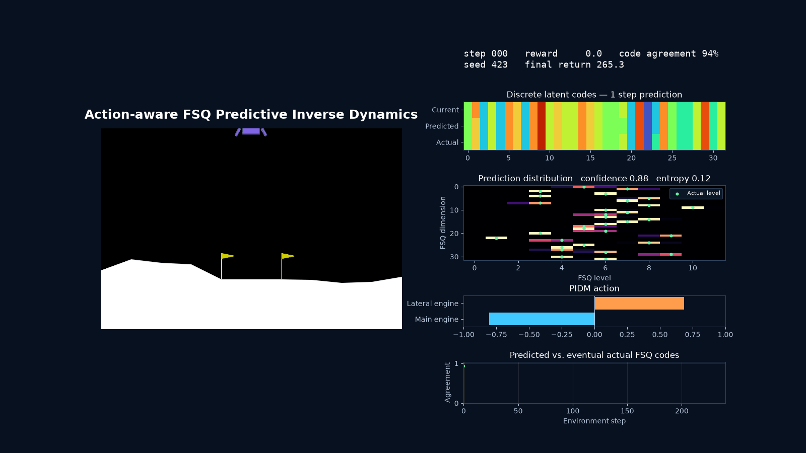
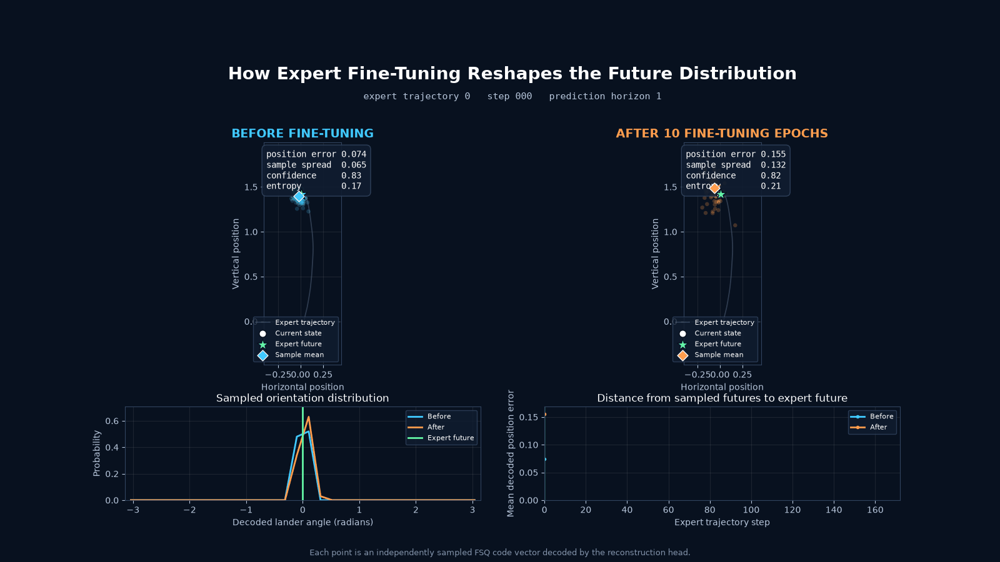

# PIDM-with-Latent-FSQ

<p align="center">
  
</p>

My implementation of predictive inverse dynamics with a latent FSQ world model, inspired by [When Does Predictive Inverse Dynamics Outperform Behavior Cloning?](https://arxiv.org/abs/2601.21718).

The idea is to learn possible future states from a large replay buffer, then adapt those predictions using a small set of expert demonstrations. An inverse dynamics policy uses the current state and a predicted future state to choose an action. FSQ gives us a discrete representation in which future prediction becomes a categorical prediction problem.

Can we combine these ideas for sample-efficient imitation learning and designer-first game AI? This repository explores that question in `LunarLanderContinuous-v3`.

## Main Ideas

### FSQ World Model

The encoder maps each observation to a vector of discrete codes using [Finite Scalar Quantization](https://arxiv.org/abs/2309.15505). A causal transformer reads a history of encoded states and predicts a distribution over future codes:

```text
state_t                       -> FSQ encoder -> z_t
history of codes              -> transformer -> predicted z_{t+k}
z_t, predicted z_{t+k}, horizon -> PIDM policy -> action_t
```

The world model is trained without action conditioning in the main scripts. It learns future-state distributions from the behavior present in the dataset. 

### Multi-Horizon Inverse Dynamics

With multiple agent horizons, the policy is trained on the current code, a ground-truth future code, and a one-hot horizon. For every horizon, the target remains the action at the **current** timestep:

```text
z_t, z_{t+1},  horizon 1  -> action_t
z_t, z_{t+5},  horizon 5  -> action_t
z_t, z_{t+10}, horizon 10 -> action_t
```

At inference, the world model gives the future code. 

## Workflow

### 1. Setup and Data

Use Python 3.13 or newer and `uv`. Dependencies are defined in [pyproject.toml](pyproject.toml).

```bash
uv sync
mkdir -p saved datasets arrays
```


To train a SAC policy:

```bash
uv run main_rl.py --model-name sac_lunar --algorithm_name sac
```

SAC saves its replay buffer to `saved/sac_lunar_buffer.pkl` when saving a checkpoint. `main_rl.py` also provides `--save-trajectories` and `--num-samples-to-save` for expert trajectory collection. Rerun the script with your trained model to collect expert demonstrations. In my experiments, I used 2 episodes of demonstrations.

The commands below assume these two local datasets are available:

- `saved/sac_lunar_buffer.pkl`: the larger dataset for world-model pretraining.
- `datasets/dataset.pkl`: the smaller expert demonstration dataset.


### 2. Pretrain the World Model

```bash
uv run main_wm.py \
  --model-name lunar_wm \
  --dataset-name saved/sac_lunar_buffer.pkl \
  --prediction-horizon 1 \
  --sequence-length 8 \
  --fsq-output-size 16 \
  --levels-dim 12 \
  --epochs-number 200 \
  --batch-size 256
```

Here, each state has `16` code dimensions, with `12` possible values per dimension. The transformer embedding size is controlled separately by `--encoder-dim` (default `128`). 


### 3. Fine-Tune and Train PIDM

```bash
uv run main_pidm.py \
  --model-name lunar_pidm \
  --world-model-name lunar_wm \
  --dataset-name datasets/dataset.pkl \
  --prediction-horizon 1 \
  --agent-horizons 1 2 3 4 5 6 7 8 9 10 \
  --world-model-epochs-number 3 \
  --world-model-batch-size 32 \
  --epochs-number 100 \
  --batch-size 32
```

This loads the pretrained world model, fine-tunes it on the expert dataset, prepares the policy's training pairs, and trains the PIDM. 

Keep the world-model architecture arguments and prediction horizon consistent with pretraining. The script evaluates the policy for 100 episodes after training and prints episode returns and their mean. `--number-of-experiments` repeats training and evaluation.


## Before and After Fine-Tuning

<p align="center">
  
</p>

This visualization compares sampled future codes decoded into state space along an expert trajectory. It shows predicted positions, sample spread, confidence, and distance to the expert future. The GIF is an illustrative run; it does not establish aggregate performance or generalization to held-out demonstrations.


## References

- [When Does Predictive Inverse Dynamics Outperform Behavior Cloning?](https://arxiv.org/abs/2601.21718)
- [Finite Scalar Quantization: VQ-VAE Made Simple](https://arxiv.org/abs/2309.15505)
- [LeWorldModel implementation](https://github.com/SestoAle/LeWorldModel)

## Note

This README was written by Codex. The author validated and corrected the readme. The repo is implemented entirely by the author. The GIFs in these repo were generated (via python scripts) by Codex. 
